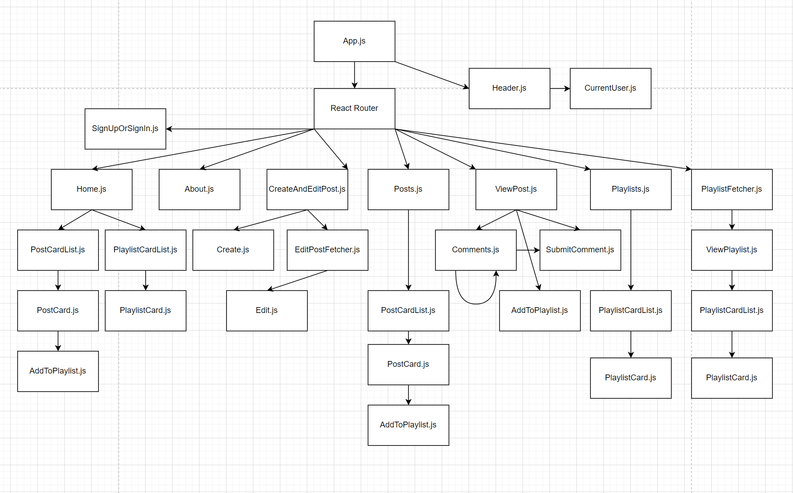

# CommEd

CommEd is a full-stack web app and a forum that offers enrichment and convenience for teachers and students who solve math problems. Users can write their solutions to math problems with professional quality typesetting of mathematical expressions. They can share, browse, and save solutions. They can also discuss solutions with each other.

CommEd was my capstone project for Flatiron School's bootcamp for software engineering. It uses React on the front-end and Flask on the back-end. It uses a Node package called react-tex to render TeX typesetting.

# How to run this app
 
In a terminal in the project directory:

    pipenv install
    pipenv shell
    cd server
    python seed.py # Performs the initial migration of the database and enters some data
    python app.py

In a second terminal in the project directory:

    cd client
    npm install
    npm run start

<!-- # User stories
   * User can post a math problem with an answer, a solution, and references.
   * Post are written in markdown, with TeX-styled equations, and links to graphics.
   * User can edit their posts.
   * User can view other users' posts.
   * User can search for posts, filter posts, and sort posts. 
   * User can comment on posts.
   * User can reply to comments.
   * User can save posts to a new playlist or an existing playlist. -->

# React component tree

# React routes

| React routes | component |
|--- | --- |
| / | Home.js |
| /sign-in-or-sign-up | SignUpOrSignIn.js |
| /about | About.js |
| /posts | Posts.js |
| /playlists | Playlist.js |
| /create | CreateAndEditPost.js |
| /edit-post/:id | CreateAndEditPost.js |
| /view-post/:id | ViewPost.js |
| /playlist/:id | PlaylistFetcher.js |

# Database schema, relationships

# API routes 

| Verb | Endpoint | Purpose | Response structure |
| --- | --- | --- | --- |
| POST | /sign-in | user signs in (This will be replaecd with implementation of user account security and privacy) | a user object |
| POST | /users | Create a new user account | a user object |
| GET | /posts | Render cards for posts | a list of post objects |
| GET | /posts/int:id | View a post | a post object |
| POST | /posts | Submit a new post | a post object |
| PATCH | /posts/int:id | Edit a post | a post object |
| DELETE | /posts/int:id | Delete a post | an empty object |
| POST | /comments | Submit a comment to a post| a comment object | 
| PATCH | /comments/int:id | Edit a comment | a comment object |
| DELETE | /comments/int:id | Delete at comment | an empty object | 
| GET | /playlists | Get a list of playlists | a list of playlist 
objects |
| POST | /playlists | Create a new playlist | a playlist object |
| GET | /playlists/int:id | Get a playlist by id | a playlist object |
| PATCH | /playlists/int:id | Add or remove a post to a playlist | a playlist object |
| DELETE | /playlists/int:id | Delete a playlist | an empty object |

<!-- | GET | /posts/int:id/comments | Render the comments on a post | a list of comments | -->
<!-- | GET | /tags | Get a list of all tags | a list of tag objects |
| POST | /tags | Create a new tag | a tag object | -->
<!-- | GET | /posts/int:id/tags | Get a list tags on a post | a list of tag objects |
| POST | /posts/int:id/tags | Add a tag to a post | a tag object |
| DELETE | /posts/int:id/tags/int:id | Remove a tag from a post | an empty object | -->
<!-- | GET | /users | Show the owners of posts and comments | a list of user objects | -->
<!-- | GET | /users/int:id | Get a user by id | a user object | -->

# Development goals

* Add privacy and security to user sessions (JWT, password hashing, encryption)
* Improve data validations and error handling
* Add a search and filter feature to lists of playlists
* Add a guide for using TeX
* Add live preview of posts and comments during creation and editing
* On the homepage, add a list of posts that the user recently viewed, so the user can easily view them again
* Add a user profile page with a history of the user's posts, playlists, and comments
* Allow users to hide their posts and playlists
* Overhaul the body structure of posts: Allow the user to add sections of certain types (heading, paragraph, equation, figure)
* Render markdown in posts and comments
* Render block-style Tex (currently rendering only inline-style TeX)
* Add a print button to posts that opens a new tab with a printer-friendly version of the post
* Implement notifications to the user when a post or comment belonging to the user receives a reply
* Enable users to show diagrams in their posts
* Enable users to show charts in their posts
* Add a view-random-post button on the homepage
* Add a 'like' feature to posts and playlists
* Allow the user to view a list of posts that they liked
* Add a Groups feature. Users can create groups and invite other users. Users can make their posts viewable only by members of certain groups.
* Overhaul styling with Tailwind or Bootstrap

# Known issues:

* Sorting post list alphabetically by author's name does not work
* Deleting a comment with children also severs the relationship of those children to the post object
* Sign Up and Sign In error messages are not displaying
* InlineTex's formatting of fractions is ugly
* User cannot use line breaks in their posts and comments